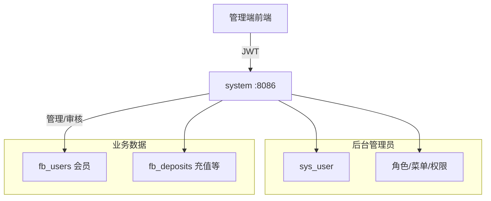
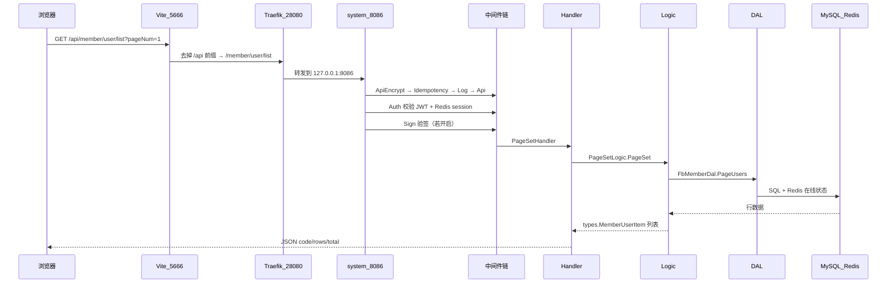
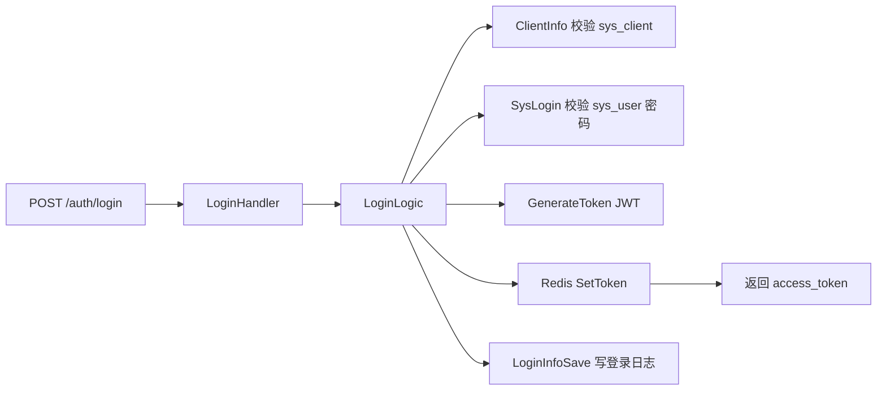

# 新手指引：从页面点击到数据库的完整链路

本文面向第一次接触本仓库的开发者，说明 **Ovra-Zero 总控后端** 是什么、怎么跑起来、一次 HTTP 请求如何穿过各层到达 MySQL/Redis，以及日常改代码应从哪里下手。

更细的专题文档：

| 文档 | 用途 |
| --- | --- |
| [local-dev.md](./local-dev.md) | 环境、配置、启动命令、Traefik、RSA 加解密 |
| [read-api-flow.md](./read-api-flow.md) | 以 `GET /member/user/list` 为例逐步跟读代码 |
| [biz-api.md](./biz-api.md) | 业务接口字段与 JSON 示例 |

---

## 1. 先建立心智模型：这是什么系统？

### 1.1 总控后台，不是 C 端用户 API

本仓库是 **管理端（总控）后端**，对接 [RuoYi-Plus-Vben5](https://gitee.com/dapppp/ruoyi-plus-vben5) 一类若依风格前端。

| 概念 | 表 / 用户 | 谁在用 | 典型 API |
| --- | --- | --- | --- |
| **后台管理员** | `sys_user` + RBAC | 运营/管理员登录后台 | `/auth/login`、`/system/user/*` |
| **业务会员（被管理对象）** | `fb_users` 等 `fb_*` | 管理员在后台查看/审核 | `/member/user/list`、`/fund/recharge/*` |

会员、充提、交易、KYC 审核等接口都在 **`system` 服务**里，由管理员 Token + 菜单权限控制，**不是** H5/App 用户自己调用的 C 端 API。

### 1.2 当前架构：总控单体

改造后 **只有一个核心进程 `system`**（端口 `8086`），同时提供：

- `/auth/*` — 登录、验证码、租户列表
- `/system/*`、`/monitor/*`、`/resource/*` — 若依系统管理
- `/member/*`、`/fund/*`、`/trade/*` … — 业务总控 API

**不需要** etcd，**不需要**单独起 auth 服务。

```text
浏览器 → Vite :5666 (/api) → Traefik :28080 → system :8086 → MySQL / Redis
                                              ↘ demo :8099（示例，可选）
```

### 1.3 两类「用户」不要混



---

## 2. 仓库目录一张图

```text
go-template-admin/
├── app/
│   ├── system/          # 核心：登录 + 系统管理 + 全部业务 API
│   └── demo/            # go-zero 示例模块（可选）
├── desc/system/api/     # 接口契约（.api），改 URL/字段先改这里
├── app/system/internal/
│   ├── handler/         # HTTP 入口（goctl 生成骨架）
│   ├── logic/           # 业务编排（最常手写）
│   ├── dal/             # 数据库 / Redis 访问
│   ├── middleware/      # Auth、Sign 等
│   └── svc/             # ServiceContext：DB、Redis、Dal 注入
├── toolkit/             # 公共：JWT、租户、加解密、响应封装
├── etc/dev/             # 本地配置（合并 common.yaml）
├── bin/
│   ├── sql/             # 初始化 SQL
│   └── traefik/         # 本地网关配置
├── docs/                # 文档（本文所在目录）
└── ruoyi-plus-vben5/    # 前端（独立仓库，需单独 clone）
```

**改接口的标准顺序**：`desc/system/api/*.api` → `make api-system` → 补全 `logic` / `dal` → 前端 `api/` + `views/`。

---

## 3. 本地跑通：最小步骤

### 3.1 依赖

| 组件 | 用途 |
| --- | --- |
| Go 1.24+ | 编译运行 |
| MySQL 8 | 主库 `ovra_zero` |
| Redis 7 | Session、验证码、在线统计等 |
| Traefik | **前端联调时必启**（`28080`） |

### 3.2 配置

编辑 [`etc/dev/common.yaml`](../etc/dev/common.yaml) 中的 MySQL、Redis 密码与地址。

导入 SQL：

```bash
mysql -uroot -p ovra_zero < bin/sql/ovra_zero.sql
# 或较新的 bin/sql/ovra_zero-2.1.sql（按你本地使用的版本）
```

### 3.3 启动顺序

**仅测后端（curl）：**

```bash
ENV=dev go run app/system/system.go
curl http://127.0.0.1:8086/auth/code
```

**对接前端（推荐）：**

```bash
# 终端 1：后端
ENV=dev go run app/system/system.go

# 终端 2：网关
make traefik-run

# 终端 3：前端（在 ruoyi-plus-vben5 目录）
pnpm dev:antd
```

默认管理员：`admin` / `admin123`（租户 `000000`，clientId 见库表 `sys_client` 或前端 `.env`）。

### 3.4 端口速查

| 端口 | 进程 | 说明 |
| --- | --- | --- |
| 5666 | Vite | 前端开发页 |
| 28080 | Traefik | 网关，前端 `/api` 指向这里 |
| 8086 | system | 所有总控 API（含 `/auth`） |
| 8099 | demo | 示例模块 |

---

## 4. 全链路：从前端点击到数据库

以 **会员列表页** 加载 `GET /member/user/list` 为例（已登录状态）。

### 4.1 端到端时序



### 4.2 前端层

| 步骤 | 位置 | 说明 |
| --- | --- | --- |
| 页面 | `ruoyi-plus-vben5/.../views/member/list/index.vue` | 表格、筛选、分页 |
| API 封装 | `.../api/member/user/index.ts` | `requestClient.get('/member/user/list', { params })` |
| 代理 | `apps/web-antd/vite.config.ts` | `/api` → `http://127.0.0.1:28080`，rewrite 去掉 `/api` |
| Token | 请求拦截器 | Header：`Authorization: Bearer <access_token>` |

前端 **不感知** auth 是否独立进程，只认路径 `/auth/login`、`/member/user/list` 等。

### 4.3 网关层（Traefik）

配置：[`bin/traefik/dynamic.yaml`](../bin/traefik/dynamic.yaml)

- `/auth`、`/member`、`/fund`、`/system` … 全部 → `http://127.0.0.1:8086`
- `/demo` → `8099`

新增 API 前缀时，若走网关，需在此 `PathPrefix` 中追加并重启 Traefik。

### 4.4 进程入口

[`app/system/system.go`](../app/system/system.go) 的 `main()`：

1. 读 `etc/dev/system.yaml` + 合并 `common.yaml`
2. `svc.NewServiceContext` — 连接 MySQL、Redis，挂载中间件与 Dal
3. `handler.RegisterHandlers` — 注册所有路由（含 `/auth` 与 `/member`）
4. 全局中间件：加解密、幂等、日志

### 4.5 路由与中间件

路由表：[`app/system/internal/handler/routes.go`](../app/system/internal/handler/routes.go)（goctl 根据 `.api` 生成）。

| 路由组 | 中间件 | 说明 |
| --- | --- | --- |
| `/auth/login`、`/auth/code` 等 | 通常仅 **Sign** | 登录前无 Token |
| `/member/*`、`/system/*` 等 | **Auth + Sign** | 需已登录 |

**Auth**（[`toolkit/middlewares/auth_middleware.go`](../toolkit/middlewares/auth_middleware.go)）：

1. 解析 JWT
2. 查 Redis 中 `token:{clientId}:{userId}` 是否存在
3. 通过则把用户信息写入 Context，供 Logic / 租户插件使用

### 4.6 Handler → Logic → DAL

以会员列表为例（详见 [read-api-flow.md](./read-api-flow.md)）：

```text
handler/member/user/page_set_handler.go   # httpx.Parse → 调 Logic → OkJson
logic/member/user/page_set_logic.go       # 组 filter → 调 Dal → 映射 rows
dal/fb_member.go                          # PageUsers：SQL 分页 + 聚合
dal/fb_user_redis.go                      # BatchOnlineStatus：Redis 在线
```

**分工原则**：

- Handler：薄，只做绑定参数和写响应
- Logic：业务流程、多表组合、类型转换
- DAL：SQL、Redis key，不出现 HTTP 概念

### 4.7 响应格式

列表类（含 `rows`）：由 [`toolkit/helper/resp.go`](../toolkit/helper/resp.go) 展平到顶层：

```json
{ "code": 200, "msg": "操作成功", "total": 100, "rows": [...] }
```

普通对象包在 `data` 内：

```json
{ "code": 200, "msg": "操作成功", "data": { ... } }
```

---

## 5. 登录链路（`/auth/login`）

登录是总控链路的起点，理解它有助于排查 401/502。



代码位置：

| 步骤 | 文件 |
| --- | --- |
| 契约 | [`desc/system/api/auth/auth.api`](../desc/system/api/auth/auth.api) |
| Handler | `handler/auth/login_handler.go` |
| Logic | [`logic/auth/login_logic.go`](../app/system/internal/logic/auth/login_logic.go) |
| 校验账号 | `logic/sysrpc/sys_login_logic.go`（进程内直调，无 gRPC） |
| 写 Token | [`toolkit/auth/auth.go`](../toolkit/auth/auth.go) |

登录成功后，后续请求带 `Authorization: Bearer <token>`，走 **Auth 中间件** 与 Redis 校验。

---

## 6. 权限与多租户（简要）

### 6.1 RBAC

- 菜单、按钮权限在 `sys_menu`、`sys_role_menu`
- 前端根据 `GET /system/user/getInfo` 返回的 `permissions` 控制按钮
- 后端路由本身依赖 **Auth**（已登录）；细粒度按钮权限多在前端 + 操作日志体现

### 6.2 多租户

- 配置：`etc/dev/common.yaml` → `Tenant.Enabled`
- 业务表带 `tenant_id` 的，由 GORM 租户插件自动加条件（见 [`toolkit/gorm/plugin/tenant_plugin.go`](../toolkit/gorm/plugin/tenant_plugin.go)）
- 登录时选 `tenantId`，写入 JWT

---

## 7. 日常开发：我要改/加一个接口

### 7.1 只改查询条件或 SQL

1. 读 [biz-api.md](./biz-api.md) 确认参数字段
2. 改 `dal/*.go` 中对应方法
3. 必要时改 `logic/*_logic.go` 映射

### 7.2 新增或修改 URL、请求/响应字段

```bash
# 1. 改契约
vim desc/system/api/member/user.api

# 2. 生成 Handler、types、routes
make api-system

# 3. 实现或更新 Logic（生成文件里是 todo 骨架）
vim app/system/internal/logic/member/user/xxx_logic.go

# 4. 需要时加 DAL
vim app/system/internal/dal/fb_member.go

# 5. 编译
go build ./...
```

### 7.3 改前端列表/表单

```text
ruoyi-plus-vben5/apps/web-antd/src/
├── api/member/user/index.ts    # 请求路径与类型
└── views/member/list/index.vue # 表格列与筛选项
```

### 7.4 改配置

| 需求 | 文件 |
| --- | --- |
| 数据库/Redis/JWT | `etc/dev/common.yaml` |
| system 端口、上传路径 | `etc/dev/system.yaml` |
| 网关路由 | `bin/traefik/dynamic.yaml` |

改配置后 **重启 system**；改 Traefik 配置后 **重启 traefik**。

---

## 8. 代码生成命令

```bash
make help

make api-system    # 由 desc/system/api 生成 HTTP 层
make db-system     # 由 gen/system/gen.yaml 生成 GORM query（改表结构后）
make build-system  # 编译 system 二进制
make run-system    # 运行（注意本地常用 ENV=dev go run ...）
```

RPC（`desc/system/rpc`）相关代码仍保留在仓库中供历史兼容，**运行时不再启动 gRPC 进程**。

---

## 9. 常见问题

| 现象 | 可能原因 | 处理 |
| --- | --- | --- |
| 前端 `/api/auth/login` 502 | system 或 Traefik 未启动 | 先起 system，再起 `make traefik-run` |
| 401 未登录 | Token 过期或 Redis 无 session | 重新登录；确认前后端共用同一 Redis |
| `/api/member/*` 404 | Traefik 缺 PathPrefix | 检查 `bin/traefik/dynamic.yaml` |
| 加解密失败 | RSA 密钥前后端不一致 | 见 [local-dev.md](./local-dev.md) RSA 章节 |
| curl 直连 8086 正常，走 28080 失败 | 网关未启或路由错误 | `curl http://127.0.0.1:28080/auth/code` |
| 改 .api 后编译报错 | 未 make api-system 或 Logic 未实现 | 生成后补全 Logic |

---

## 10. 建议学习路径（第一天 → 第一周）

**第一天**

1. 读本文 §1～§3，本地跑通 system + Traefik
2. `curl` 登录拿 Token，再请求 `/member/user/list`
3. 跟读 [read-api-flow.md](./read-api-flow.md) 一条完整链路

**第二天**

1. 在 `biz-api.md` 选一个熟悉页面（如充值列表）
2. 从 `.api` 跟到 `dal`，对照前端 Network 面板参数
3. 尝试改一个筛选条件（仅 DAL），观察列表变化

**第一周**

1. 走通「改 .api → make api-system → Logic → DAL」新增一个小字段
2. 读 `toolkit/auth`、`middleware` 理解登录与鉴权
3. 需要部署时读 [local-dev.md](./local-dev.md) 与 [HELM_CHART_K3D.md](../deploy/k3d/docs/HELM_CHART_K3D.md)

---

## 11. 相关链接

- [本地开发详解](./local-dev.md)
- [接口跟读示例](./read-api-flow.md)
- [业务 API 字段手册](./biz-api.md)
- [项目 README](../README.md)
